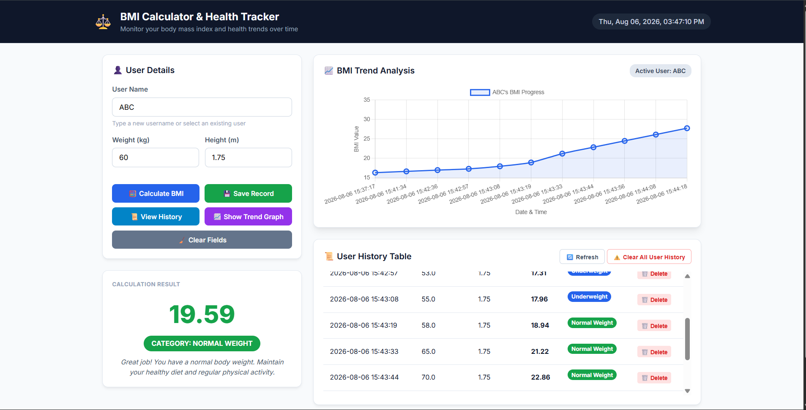

# ⚖️ BMI Calculator & Health Tracker

A professional Body Mass Index (BMI) calculator and health tracking application available as both a **Desktop Application (Tkinter)** and a **Localhost Web Application (Flask)** powered by **Python 3**, **SQLite3**, and **Matplotlib / Chart.js**.

---

## 📌 Project Overview

**BMI Calculator & Health Tracker** helps users calculate, track, and analyze their Body Mass Index over time. It classifies BMI into official World Health Organization (WHO) categories, provides customized health recommendations, stores entries persistently in an SQLite database (`bmi.db`), supports multi-user tracking, and generates visual trend graphs.

You can run the application in two ways:
1. **Desktop GUI Mode (`main.py`)**: Tkinter window with native controls, live clock, tooltips, and secondary history window.
2. **Localhost Web Server Mode (`app.py`)**: Web application accessible in your browser at `http://localhost:5000/`.

---

## ✨ Key Features

- **🧮 Accurate BMI Calculation**: Instant BMI computation rounded to 2 decimal places using standard WHO formula.
- **🎨 Color-Coded Health Categories**:
  - 🔵 **Underweight**: `BMI < 18.5` (Blue)
  - 🟢 **Normal Weight**: `18.5 – 24.9` (Green)
  - 🟠 **Overweight**: `25.0 – 29.9` (Orange)
  - 🔴 **Obese**: `BMI ≥ 30.0` (Red)
- **💬 Personalized Health Advice**: Tailored health tips and medical guidance based on the user's BMI category.
- **🛡️ Robust Input Validation**: Rejects empty inputs, non-numeric characters, negative numbers, and unrealistic height bounds.
- **💾 SQLite Persistent Storage**: Automatically creates and manages `bmi.db` to save calculation history with timestamps (`YYYY-MM-DD HH:MM:SS`).
- **👥 Multi-User Support**: Tracks individual history for multiple users with auto-suggesting comboboxes.
- **📜 User History Table**: Displays record history with options to delete individual rows or clear all records for a user.
- **📈 Interactive Trend Graph**: Visual trend charts (Matplotlib line plots on Desktop / Chart.js on Web).
- **🌐 Dual Execution Modes**: Native Desktop GUI or Localhost Web Application in your browser.

---

## 📁 Project Structure

```text
BMI_Calculator/
│
├── main.py            # Desktop Tkinter GUI application
├── app.py             # Localhost Web Server application (Flask)
├── database.py        # SQLite database operations (CRUD, table init, queries)
├── bmi.py             # Pure business logic (BMI formula, categories, input validation)
├── graph.py            # Matplotlib visualization module
├── requirements.txt   # Third-party Python dependencies (matplotlib, flask)
├── README.md          # Project documentation and manual
├── bmi.db             # SQLite database file (created automatically on launch)
├── templates/         # Web templates
│   └── index.html     # Web dashboard HTML template
├── static/            # Web static assets
│   ├── style.css      # CSS styling and theme
│   └── script.js      # Client-side JavaScript logic & Chart.js graph
└── screenshots/       # Preview screenshots
    ├── home.png       # Main GUI dashboard screenshot
    └── graph.png      # BMI trend chart screenshot
```

---

## ⚙️ Installation & Requirements

### System Requirements
- **Python**: Version 3.8 or higher.
- **Dependencies**: `matplotlib`, `flask`

### Installation Steps

1. **Clone or Download the Repository**:
   ```bash
   git clone https://github.com/your-username/BMI_Calculator.git
   cd BMI_Calculator
   ```

2. **Install Required Packages**:
   ```bash
   pip install -r requirements.txt
   ```

---

## 🚀 How to Run the Project

### Option A: Localhost Web Application (`http://localhost:5000/`)

Run the Flask web server:

```bash
python app.py
```

Then open your browser and navigate to:
👉 **[http://localhost:5000/](http://localhost:5000/)**

---

### Option B: Native Desktop GUI Application

Run the Tkinter desktop GUI:

```bash
python main.py
```

---

## 🖼️ Screenshots

| Main Dashboard (`home.png`) | BMI Trend Graph (`graph.png`) |
| :---: | :---: |
|  |  |

---

## 🛠️ Code Architecture

- **`bmi.py`**: Pure calculation logic (`calculate_bmi`), category classification (`get_bmi_category`), color codes, health messages, and validation (`validate_inputs`).
- **`database.py`**: SQLite CRUD functions (`init_db`, `save_record`, `get_user_history`, `get_all_users`, `delete_record`, `clear_user_history`).
- **`graph.py`**: Matplotlib trend visualization line chart with WHO thresholds.
- **`app.py`**: Flask web server hosting endpoints at `http://localhost:5000/`.
- **`main.py`**: Tkinter desktop app window.
#
